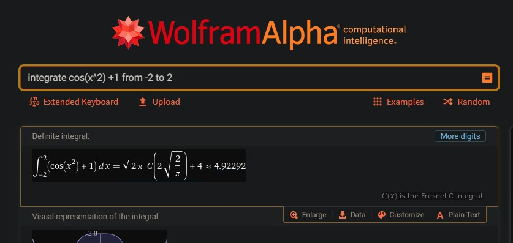
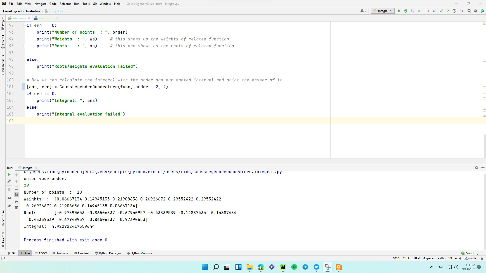

# Calculating The Integral Of Any Function By Gauss Legendre Quadrature

---
 Actually this code help us find any integral's function we want, but we should input the function every time we want to
 change it.
 ---
### Some Example (Different Function):
## Integral of Cos(x^2)+1 from -2 to 2 

 
## Output of our code:

